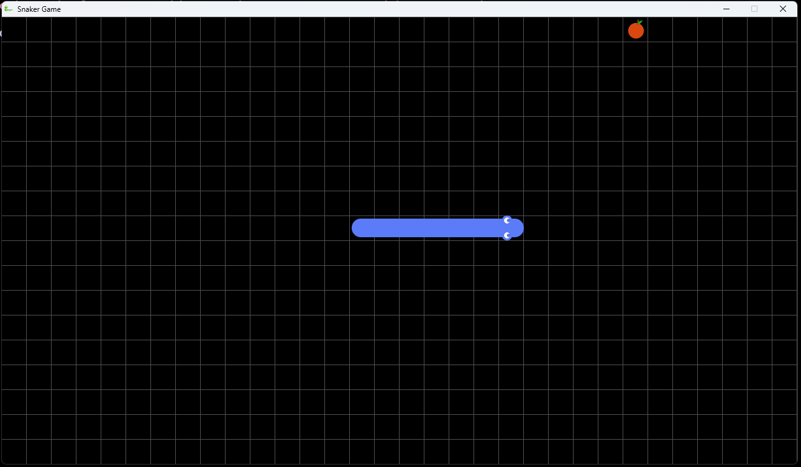

# Snaker

> [!WARNING]
> This game is under activate development. Anything can change at any moment without any notice!

Simple snake game build in C and raylib



## Building

```console
$ make
```

Running `make` will build for both linux and windows (static and dynamic linked).
Make sure you have the tools needed. Just see the Makefile to find out what tools are needed.
